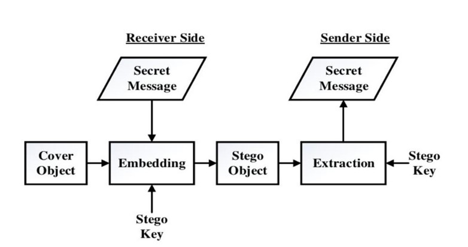

# **Pixsy**

This project explores video and image steganography, which is hiding secret messages within digital videos or images. This allows the secret message to be hidden within the video or image without causing noticeable changes. Further a layer of security is added where the message is encrypted using **AES algorithm**.

## **FLOW DIAGRAM**

](https://github.com/farvath/Pixsy/blob/main/stego%20flow%20chart.jpg)

## **IMAGE STEGANOGRAPHY :**

* Using Least Significant Bit Insertion we overwrite the LSB bit of actual image with the bit of text message character. At the end of text message we push a delimiter to the message string as a checkpoint useful in decoding function.
* We encode data in order of Red, then Green and then Blue pixel for the entire message.
##  **VIDEO STEGANOGRAPHY**

Similar approach is followed in video steganography, here each frame is treated as image then the following steps are executed :

**1. Encryption**

* Leverages the Fernet library (Cryptography package) for secure message encryption.
* Utilizes a user-provided key for both encryption and decryption.

**2. Modified Least Significant Bit (LSB) Steganography**

* Hides the encrypted message within the video frames by overwriting the least significant bits (LSBs).
* Employs Red, Green, and Blue channels sequentially for embedding message bits.
* Utilizes a delimiter to mark the end of the hidden message.

## **ADVANTAGES**

* **Enhanced Security:** Combining encryption with steganography offers a layered security approach.
* **Improved Covertness:** Steganography helps conceal the message's presence within the video.
  
## **IMAGE COMPARISON**
](https://github.com/farvath/Pixsy/blob/main/inp_img.jpg)

Input Image 

](https://github.com/farvath/Pixsy/blob/main/out_img.jpg)

Stego Image

## **IMAGE COMPARISON**

| Image | Description |
|---|---|
| ](https://github.com/farvath/Pixsy/blob/main/inp_img.jpg) | Input Image |
| ](https://github.com/farvath/Pixsy/blob/main/out_img.jpg)| Stego Image |

